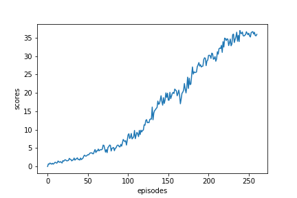

[//]: # (Image References)

[image1]: https://user-images.githubusercontent.com/10624937/43851024-320ba930-9aff-11e8-8493-ee547c6af349.gif "Trained Agent"
[image2]: https://user-images.githubusercontent.com/10624937/43851646-d899bf20-9b00-11e8-858c-29b5c2c94ccc.png "Crawler"


# Project 2: Continuous Control

### Introduction

For this project, you will work with the [Reacher](https://github.com/Unity-Technologies/ml-agents/blob/master/docs/Learning-Environment-Examples.md#reacher) environment.

![Trained Agent][image1]

In this environment, a double-jointed arm can move to target locations. A reward of +0.1 is provided for each step that the agent's hand is in the goal location. Thus, the goal of your agent is to maintain its position at the target location for as many time steps as possible.

The observation space consists of 33 variables corresponding to position, rotation, velocity, and angular velocities of the arm. Each action is a vector with four numbers, corresponding to torque applicable to two joints. Every entry in the action vector should be a number between -1 and 1.


### Completion
The task is episodic, and in order to solve the environment,  your agent must get an average score of +30 over 100 consecutive episodes.


### Environment

We start the environment as follows:

_env = UnityEnvironment(file_name='/data/Reacher_Linux_NoVis/Reacher.x86_64')_

### Training session and parameter

We experience the following parameters:  _n_fc1_, _n_fc2_.
For the training session for both Actor and Critic Networks, 
 * _n_fc1_ is played out as a value 128,
 * _n_fc2_ is played out as a value 128.

For the training session, we construct the **agent** with above parameters
and we run the *Deep-Q-Network* procedure **ddpg** as follows:

  agent = **Agent**(state_size=state_size, action_size=action_size, random_seed=8)<br>
  scores = **ddpg**()


### Results

  
## Dependencies

To set up your python environment to run the notebook, follow the instructions below.

1. Create (and activate) a new environment with Python 3.6.

	- __Linux__ or __Mac__: 
	```bash
	conda create --name drlnd python=3.6
	source activate drlnd
	```
	- __Windows__: 
	```bash
	conda create --name drlnd python=3.6 
	activate drlnd
	```
	
2. Clone the repository (if you haven't already!), and navigate to the `python/` folder.  Then, install several dependencies.
```bash
git clone https://github.com/udacity/deep-reinforcement-learning.git
cd deep-reinforcement-learning/python
pip install .
```

3. Then run the code cells of **Continuous_Control.ipynb** one by one in jupyter notebook.
```bash
jupyter notebook
```
  
### Credit

Most of the code is based on the Udacity code for DDPG and Pytorch tutorials.
