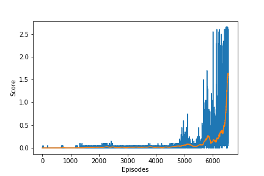

[//]: # (Image References)

[image1]: https://user-images.githubusercontent.com/10624937/42135623-e770e354-7d12-11e8-998d-29fc74429ca2.gif "Trained Agent"
[image2]: https://user-images.githubusercontent.com/10624937/42135622-e55fb586-7d12-11e8-8a54-3c31da15a90a.gif "Soccer"


# Project 3: Collaboration and Competition

### Introduction

For this project, you will work with the [Tennis](https://github.com/Unity-Technologies/ml-agents/blob/master/docs/Learning-Environment-Examples.md#tennis) environment.

![Trained Agent][image1]

In this environment, two agents control rackets to bounce a ball over a net. If an agent hits the ball over the net, it receives a reward of +0.1.  If an agent lets a ball hit the ground or hits the ball out of bounds, it receives a reward of -0.01.  Thus, the goal of each agent is to keep the ball in play.

The observation space consists of 8 variables corresponding to the position and velocity of the ball and racket. Each agent receives its own, local observation.  Two continuous actions are available, corresponding to movement toward (or away from) the net, and jumping. 

The task is episodic, and in order to solve the environment, your agents must get an average score of +0.5 (over 100 consecutive episodes, after taking the maximum over both agents). Specifically,

- After each episode, we add up the rewards that each agent received (without discounting), to get a score for each agent. This yields 2 (potentially different) scores. We then take the maximum of these 2 scores.
- This yields a single **score** for each episode.


### Completion
The environment is considered solved, when the average (over 100 episodes) of those **scores** is at least +0.5.

### Environment

We start the environment as follows:

_env = UnityEnvironment(file_name="/data/Tennis_Linux_NoVis/Tennis")_

### Training session and parameter

There are total 8 networks, 4 for each agent, in which each Actor and Critic have local and target networks.
For Actor:
Fully-Connected Layer 1, number of neurons: _state_size_ x _n_fc1_ ,
Fully-Connected Layer 2, number of neurons: _n_fc1_ x _n_fc2_ ,
Fully-Connected Layer 3, number of neurons: _n_fc2_ x _action_size_ ,
For the training session for Actor Networks, 
 * _n_fc1_ is played out as a value 32,
 * _n_fc2_ is played out as a value 32.
 
For Critic:
Fully-Connected Layer 1, number of neurons: _(state_size + action_size) x n_agents x _n_fcs1_ ,
Fully-Connected Layer 2, number of neurons: _n_fcs1_ x _n_fc2_ ,
Fully-Connected Layer 3, number of neurons: _n_fc2_ x 1 ,
For the training session for Actor Networks, 
 * _n_fcs1_ is played out as a value 64,
 * _n_fc2_ is played out as a value 64.

Following are the fractions of code used for training,
 * model.py, containing Actor and Critic model network class.
 * agent.py, containing Agent class for learning and getting next actions for the agent.
 * noise.py, containing OUNoise for Ornstein-Uhlenbeck process.
 * replay_buffer.py, containing ReplayBuffer class for past experiences.
 * agent_handler.py, containing AgentHandler class for maintaining all the agents in the environment.


For the training session, we construct the **agent** with above parameters
and we run the procedure to train as follows:

  maddpg = **AgentHandler()**<br>
  scores_total, scores_global = **train**(maddpg, env, dir_chkpoints, n_episodes=10000)


### Results

  
## Dependencies

To set up your python environment to run the notebook, follow the instructions below.

1. Create (and activate) a new environment with Python 3.6.

	- __Linux__ or __Mac__: 
	```bash
	conda create --name drlnd python=3.6
	source activate drlnd
	```
	- __Windows__: 
	```bash
	conda create --name drlnd python=3.6 
	activate drlnd
	```
	
2. Clone the repository (if you haven't already!), and navigate to the `python/` folder.  Then, install several dependencies.
```bash
git clone https://github.com/udacity/deep-reinforcement-learning.git
cd deep-reinforcement-learning/python
pip install .
```

3. Then run the code cells of **Tennis.ipynb** one by one in jupyter notebook.
```bash
jupyter notebook
```
  
### Credit

Most of the code is based on the Udacity code for DDPG and Pytorch tutorials.
